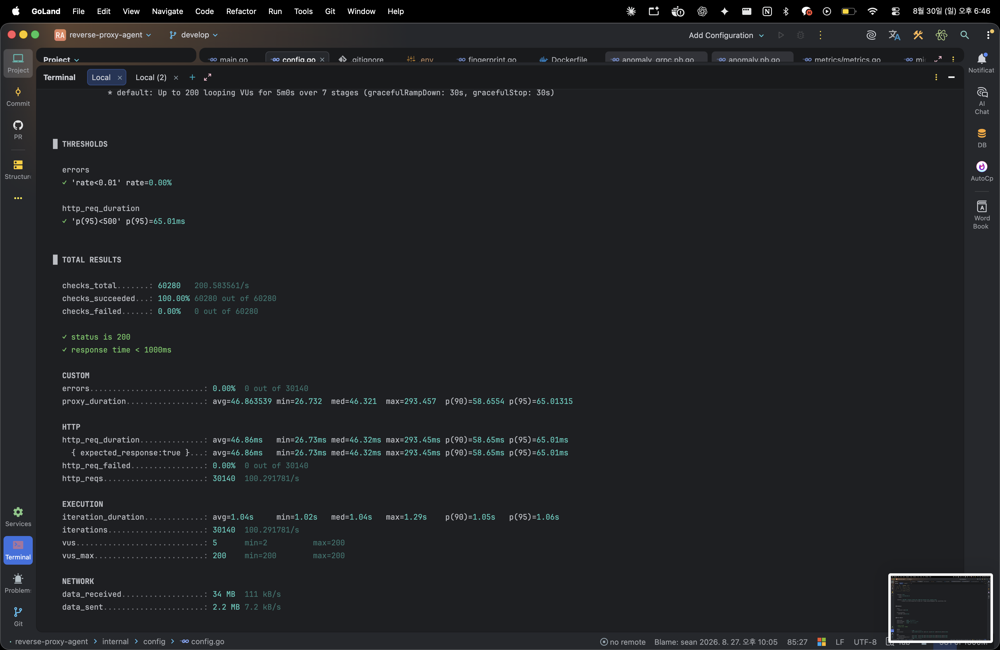

# AI 보안 미들웨어를 실제 서버에 붙여봤더니 벌어진 일들


## 들어가며

PickStranger는 OAuth2 로그인 이후 발생하는 계정 연쇄 탈취(Account Takeover)를 막기 위한 보안 미들웨어 프로젝트다. 나는 그중 Go로 작성된 리버스 프록시(이하 rev)를 담당하고 있다.

지금까지는 Mock AI 클라이언트로만 테스트해왔는데, 이번에 실제 AI 분석 서버와 처음으로 연동하고 Azure VM에 배포하면서 예상치 못한 문제들을 연달아 마주쳤다. 이 글은 그 과정에서 발견한 문제들과 해결 방법을 정리한 기록이다.

---

## 1. "존재하지 않는 메서드입니다" — gRPC 인터페이스 불일치

Mock 모드(`USE_MOCK_AI=true`)로는 문제없이 돌아가던 시스템을, 실제 AI 서버에 연결(`USE_MOCK_AI=false`)하자마자 에러가 쏟아졌다.

```
rpc error: code = Unimplemented desc = Method not found!
```

원인을 파고들어 보니 어이없게도 **rev와 AI 서버가 각자 독립적으로 설계한 gRPC 인터페이스를 쓰고 있었다.**

| | rev가 기대하던 것 | AI 서버가 실제로 제공하는 것 |
|---|---|---|
| 서비스명 | `AnomalyAnalyzeService` | `RBAService` |
| 메서드명 | `Analyze` | `Predict` |
| 요청 필드 | session_token, ip, user_agent 등 | user_id, os_name, browser_name, webgl_renderer 등 (훨씬 풍부함) |

두 팀원이 각자 프로토콜을 설계하고, 한 번도 실제로 맞춰보지 않은 채 개발을 진행했던 것이다. Mock으로 테스트할 때는 이 불일치가 전혀 드러나지 않았다 — mock 클라이언트는 그냥 내가 만든 대로 동작하니까.

**교훈**: 통합 지점의 인터페이스는 "설계 문서"가 아니라 "실제로 상대방이 구현한 코드"를 기준으로 맞춰야 한다. Mock 기반 개발은 각 컴포넌트의 로직 검증에는 유용하지만, 인터페이스 정합성까지 보장해주지는 않는다.

해결은 AI 서버의 실제 `.proto` 파일을 가져와서 `protoc`로 재생성하고, rev의 클라이언트 코드를 `Predict` RPC 기준으로 다시 작성하는 것이었다.

---

## 2. 부하테스트가 알려준 진짜 병목

gRPC 통신을 고친 뒤, k6로 부하테스트를 돌려봤다. 처음엔 단순 프록시 경로(`/`)만 테스트했는데, 최대 200명 동시접속에서도 p95 지연시간 65ms, 에러율 0%로 매우 안정적이었다.

문제는 실제 AI 판정이 포함된 `/internal/analyze` 경로였다.

```
checks_succeeded: 70.93%
errors: 29.07%
http_req_duration p95: 5.03s  ← AI 타임아웃 설정값(5s)과 정확히 일치
```

에러율 29%. 게다가 p95 지연시간이 정확히 AI 타임아웃 설정값과 일치한다는 게 힌트였다. 부하가 몰리면 AI 서버 응답이 느려지고, rev가 설정한 5초 타임아웃에 걸려서 실패하는 패턴이었다.

`docker stats`로 실시간 리소스를 관찰하며 원인을 확인했다.

```
CONTAINER            CPU %
pickstranger-rev     0.99%
pickstranger-ai      185.57%   ← 2 vCPU 인스턴스에서 거의 다 써버림
```

**rev(리버스 프록시)는 CPU 1% 미만으로 전혀 부담이 없었다.** 병목은 AI 추론 서버였다. 저사양 VM(2 vCPU)에서 XGBoost 추론이 동시 요청을 감당하지 못하고 CPU를 독점하면서, 전체 시스템이 느려지는 구조였다.

이 발견의 의미는 단순히 "느리다"가 아니라, **"어느 컴포넌트가 병목인지 데이터로 증명했다"**는 데 있다. 담당이 나뉜 프로젝트에서 "느린 것 같은데요"보다 "여기가 병목입니다, 근거는 이겁니다"라고 말할 수 있는 건 완전히 다른 대화를 만든다.


---

## 3. AI 서버가 죽으면 우리 서비스도 같이 죽어야 할까?

병목을 찾은 것과는 별개로, 더 근본적인 질문이 남아있었다. **AI 서버가 완전히 죽으면 어떻게 되는가?**

테스트해보니 답은 "모든 요청이 500 에러로 실패한다"였다. rev가 AI 서버 호출 결과를 기다리다가 실패하면 그대로 에러를 반환하는 구조였기 때문이다. 이건 이 프로젝트의 핵심 설계 원칙과 정면으로 배치된다 — "각 서비스에 장애가 생겼을 때 원래 서비스까지 멈추는 현상을 방지해야 한다"는 목표를 세워놓고, 정작 AI 서버 장애가 전체를 마비시키는 구조였던 것.

그래서 Circuit Breaker(회로차단기) 패턴을 넣었다. 동작 원리는 간단하다.

- AI 호출이 연속으로 N번(기본 5회) 실패하면 회로가 "열림" 상태로 전환
- 열린 상태에서는 일정 시간(기본 30초) 동안 **AI 서버를 아예 호출하지 않고** 안전한 기본값(ALLOW)으로 즉시 응답
- 시간이 지나면 다시 정상 호출을 시도

```go
func (cb *CircuitBreaker) Predict(ctx context.Context, req *PredictInput) (*PredictResult, error) {
    if 회로가_열려있으면 {
        // AI 호출 생략, 즉시 안전한 기본값 반환
        return &PredictResult{IsAnomaly: false, RiskScore: 0}, nil
    }
    // 정상 호출 시도, 실패하면 카운트하고 임계치 도달 시 회로 열기
    ...
}
```

실제로 AI 서버 컨테이너를 강제로 중지시켜서 장애를 재현해봤다.

```
요청 1~5: Internal Server Error
요청 6:   {"action":"ALLOW","is_anomaly":false,...}  ← 정상 응답으로 자동 전환
```

로그에는 이렇게 남았다.

```
회로차단기 OPEN 전환: 연속 실패 5회 도달, 30s 동안 AI 호출 생략
회로차단기 OPEN: AI 호출 생략, 기본 ALLOW 처리 user=test_user_6
```

AI 서버가 완전히 죽어있는 상태에서도, 서비스는 계속 요청을 처리했다. "보안 판정을 못 하니 일단 다 통과시킨다"는 게 이상적인 정책은 아니지만(Fail-Open vs Fail-Closed는 도메인마다 다른 선택이 필요하다), 적어도 "AI 서버 장애 = 전체 서비스 다운"이라는 최악의 시나리오는 피할 수 있게 됐다.

---

## 4. 눈으로 보이지 않으면 존재하지 않는 것과 같다

여기까지 오면서 느낀 건, 로그만으로는 전체 그림을 파악하기 어렵다는 점이었다. `docker compose logs`를 스크롤하며 패턴을 찾는 건 한계가 있다.

그래서 Prometheus + Grafana를 붙였다. rev에 `/metrics` 엔드포인트를 열어 요청 수, 지연시간, Circuit Breaker 상태를 계측하고, Grafana 대시보드로 시각화했다.

몇 가지 삽질도 있었다 — 특히 `rate()` 함수를 쓴 쿼리들이 계속 "No data"를 뱉는 이슈가 있었는데, `sum()`/`increase()` 조합이나 raw 카운터 값으로 우회해서 해결했다. (원인은 아직 명확하지 않은데, Prometheus scrape 간격과 Grafana의 자동 step 계산이 미묘하게 안 맞았던 것으로 추정된다.)

결과적으로 만든 대시보드에는:
- 엔드포인트별 요청 수 추이
- `/internal/analyze`의 P95 지연시간 (부하 시 15초까지 치솟는 게 선명하게 보인다)
- Circuit Breaker 상태 변화 (장애 재현 테스트 이력이 그대로 남았다)

가 실시간으로 찍힌다. 텍스트 로그로는 절대 한눈에 안 들어오던 "언제, 얼마나 심각하게" 문제가 생겼는지가 그래프 하나로 명확해졌다.

---

## 마무리

오늘 하루의 흐름을 요약하면:

1. **통신이 안 됨** → 프로토콜 재정의로 해결
2. **통신은 되는데 부하에 약함** → 부하테스트로 병목이 AI 서버임을 증명
3. **병목은 있는데, 그게 전체를 마비시킴** → Circuit Breaker로 장애 격리
4. **잘 되는지 안 되는지 눈으로 안 보임** → Prometheus/Grafana로 관측 가능하게 만듦

각 단계가 다음 문제를 자연스럽게 드러내는 흐름이었다. 어느 하나만 했다면 "일단 되긴 하네"에서 멈췄을 텐데, 끝까지 파고드니 실제 운영 환경에서 벌어질 법한 문제들을 미리 만나볼 수 있었다.

다음 단계는 AI 서버 쪽 CPU 병목 해결(워커 풀 조정 또는 모델 최적화)과, 지금은 임시방편으로 넘어간 `risk_score` 스케일 불일치 문제를 AI 팀과 함께 정리하는 것이다.

